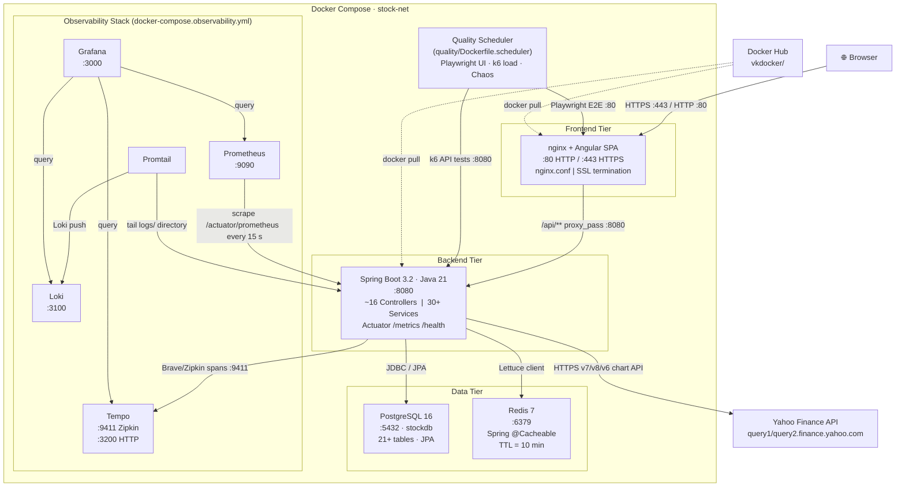
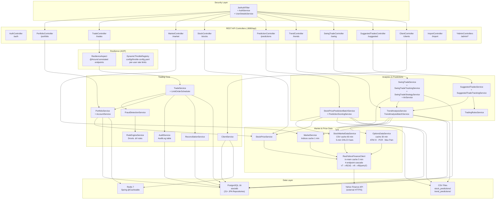
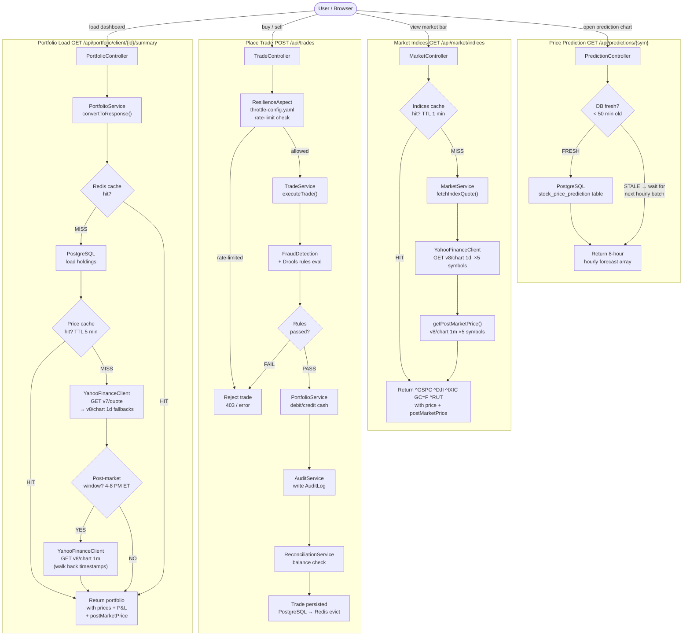
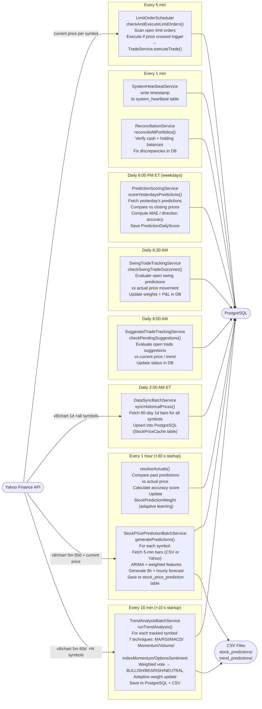
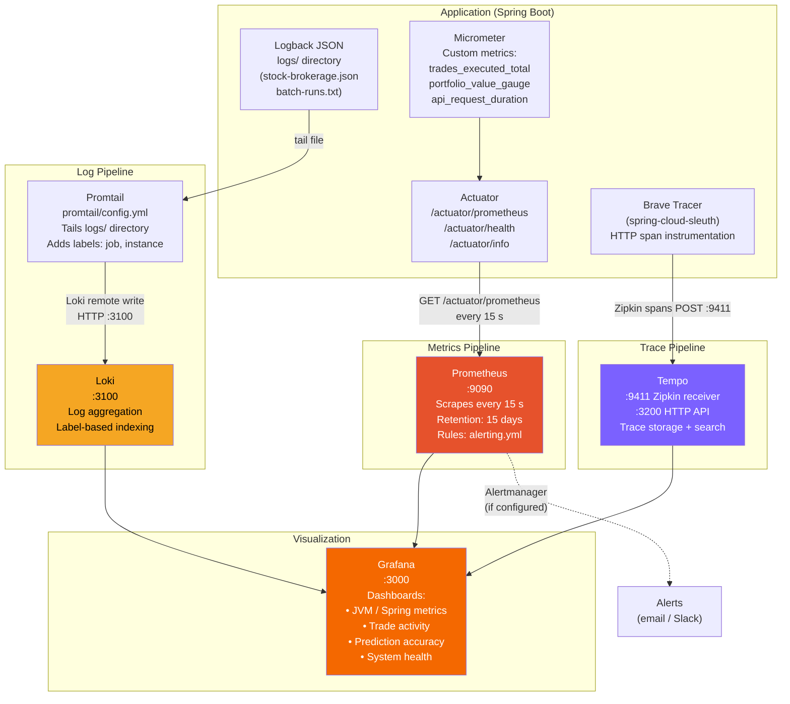

# Architecture Diagrams

Five diagrams covering deployment topology, service wiring, real-time data flow, scheduled batch processing, and observability.

---

## 1. System Deployment Topology

All Docker containers with ports, network connections, volumes, and external systems.

---

## 2. Backend Service Architecture

All controllers grouped by domain, wired through security and resilience layers into service groups, down to data stores and external APIs.

---

## 3. Real-time Data Flow (User-triggered)

End-to-end flows for the four main user interactions, with cache hit/miss decision points and TTL labels.

---

## 4. Scheduled Batch Processing Pipeline

All 9 schedulers grouped by frequency, showing what Yahoo Finance endpoints they call and where they write output.

---

## 5. Observability & Monitoring Stack

Three signal pipelines (metrics, logs, traces) converging into Grafana, plus the quality scheduler for automated testing.

