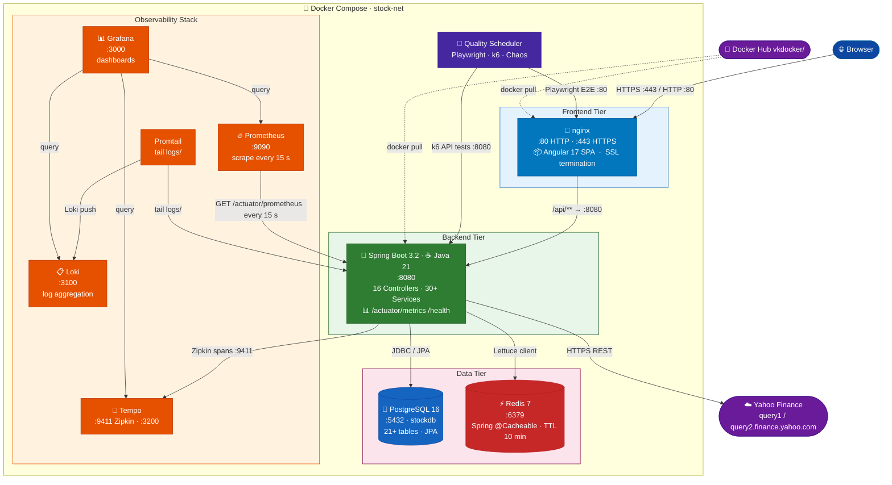
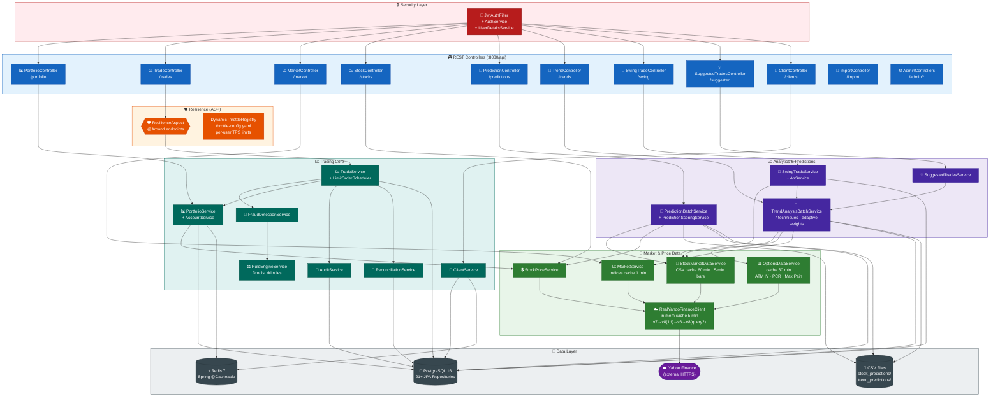
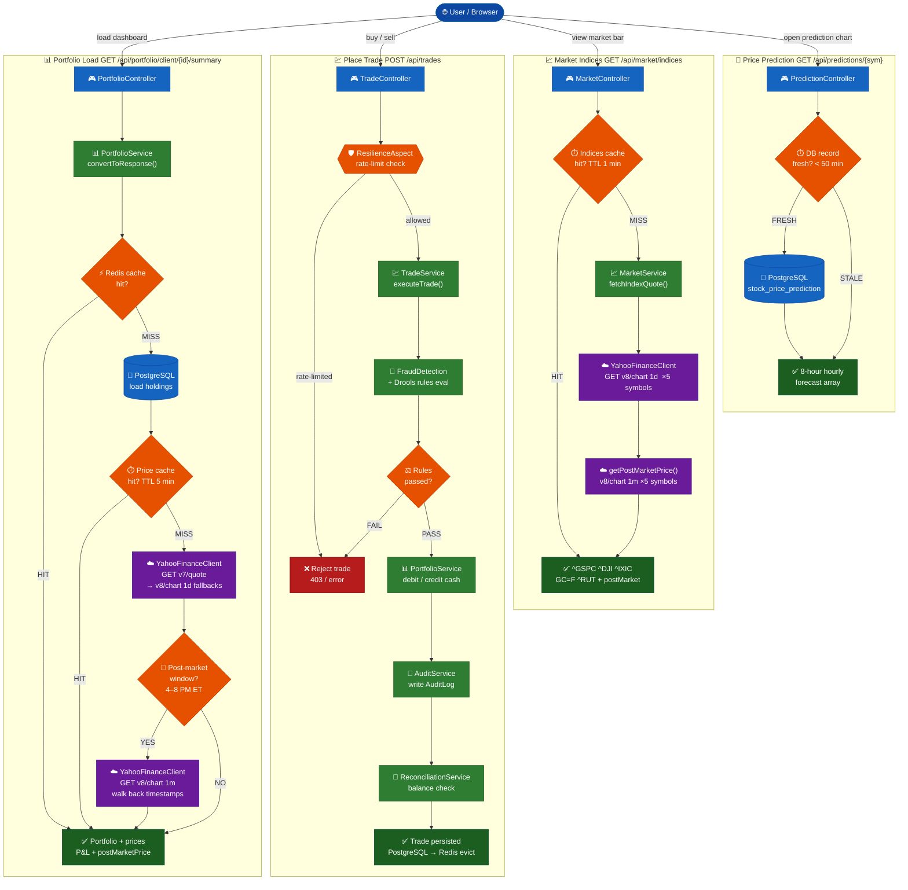
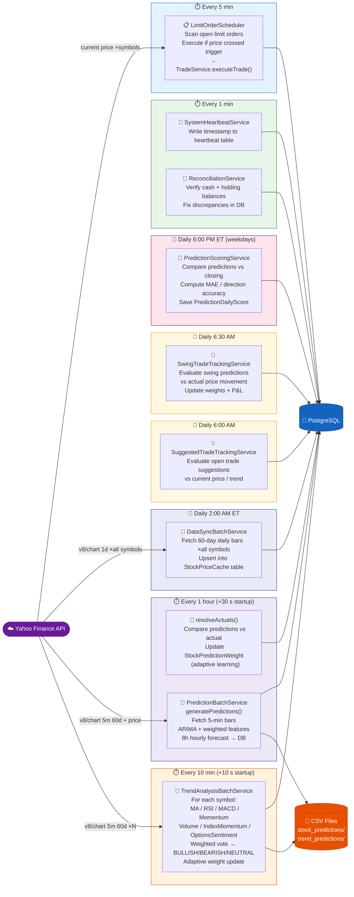
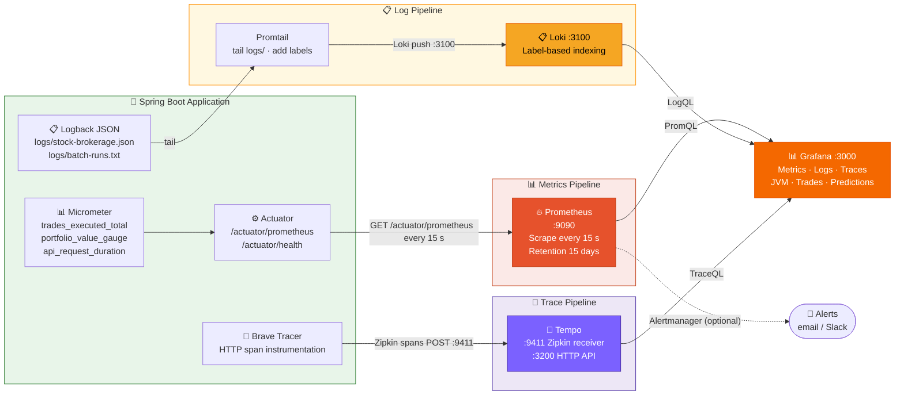
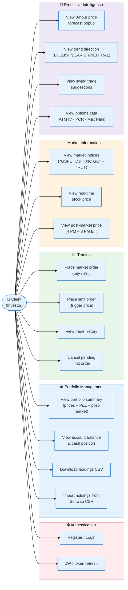
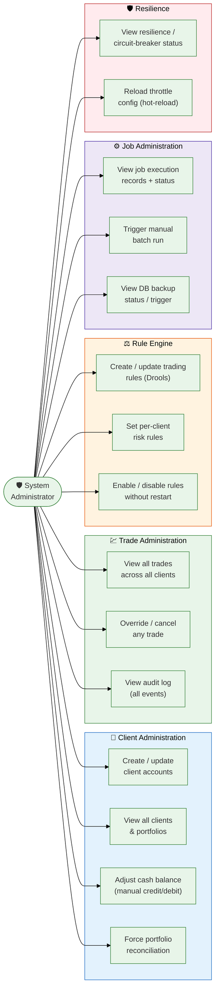
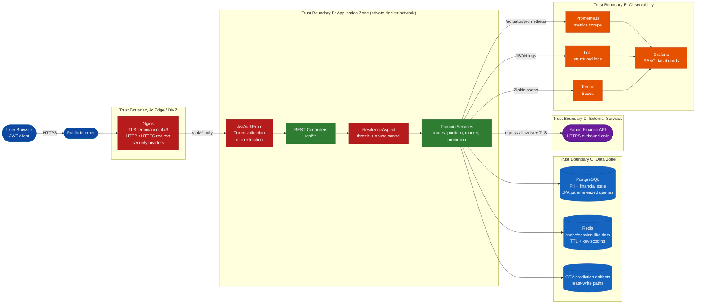

# Architecture Diagrams

Eleven diagrams and models: deployment topology, service architecture, real-time data flow, scheduled batch processing, observability stack, use cases for clients, admins, and the automated scheduler, plus a security architecture view, a STRIDE threat model, and a data-classification security matrix.

## Table of Contents

1. [System Deployment Topology](#1-system-deployment-topology)
2. [Backend Service Architecture](#2-backend-service-architecture)
3. [Real-time Data Flow](#3-real-time-data-flow-user-triggered)
4. [Scheduled Batch Processing](#4-scheduled-batch-processing-pipeline)
5. [Observability & Monitoring](#5-observability--monitoring-stack)
6. [Client / Investor Use Cases](#6-client--investor-use-cases)
7. [Admin Use Cases](#7-admin-use-cases)
8. [System Scheduler Use Cases](#8-system-scheduler-use-cases)
9. [Security Architecture Diagram](#9-security-architecture-diagram)
10. [Threat Model (STRIDE)](#10-threat-model-stride)
11. [Data Classification & Encryption Controls](#11-data-classification--encryption-controls)

---

## 1. System Deployment Topology

All containers with ports, network connections, and external systems. Databases use cylinder shapes; external services use pill shapes.

---

## 2. Backend Service Architecture

Controllers route through JWT security and AOP resilience into domain service groups, down to data stores and external APIs.

---

## 3. Real-time Data Flow (User-triggered)

End-to-end flows with cache decision points (diamonds), TTL labels, success/error outcomes.

---

## 4. Scheduled Batch Processing Pipeline

All 9 schedulers grouped by frequency, color-coded by cadence, showing Yahoo endpoints and persistence targets.

---

## 5. Observability & Monitoring Stack

Three signal pipelines (metrics → Prometheus, logs → Loki, traces → Tempo) all converging into Grafana.

---

## 6. Client / Investor Use Cases

All actions available to a logged-in retail investor.

---

## 7. Admin Use Cases

Actions available exclusively to system administrators.

---

## 8. System Scheduler Use Cases

Automated use cases performed by the Spring `@Scheduled` subsystem with no human interaction.

```mermaid
%%{init: {"theme": "base", "themeVariables": {"primaryColor": "#EDE7F6", "primaryBorderColor": "#4527A0"}}}%%
graph TB
    actor3(["⏰ System Scheduler\n(Spring @Scheduled)"])

    subgraph HighFreq["⚡ High-frequency  (1–5 min)"]
        S1["Reconcile all portfolio\nand cash balances  every 1 min"]
        S2["Write system heartbeat\nto DB  every 1 min"]
        S3["Execute triggered\nlimit orders  every 5 min"]
    end

    subgraph MedFreq["🔄 Medium-frequency  (10 min – 1 hr)"]
        S4["Run 7-technique trend analysis\nfor all symbols  every 10 min"]
        S5["Generate 8-hour price\nforecasts  every 1 hour"]
        S6["Resolve prediction actuals\n& update weights  every 1 hour"]
    end

    subgraph DailyJobs["📅 Daily Jobs"]
        S7["Sync 60-day OHLCV bars\nfrom Yahoo Finance  2:00 AM"]
        S8["Evaluate pending\ntrade suggestions  6:00 AM"]
        S9["Evaluate swing trade\noutcomes + P&L  6:30 AM"]
        S10["Score yesterday's price\npredictions (MAE)  6:00 PM weekdays"]
    end

    subgraph Outputs["💾 Outputs"]
        O1[("🐘 PostgreSQL\n(persistent state)")]
        O2[("📁 CSV Files\nweights + predictions")]
        O3[("☁️ Yahoo Finance\n(read-only API calls)")]
    end

    actor3 --> S1 & S2 & S3
    actor3 --> S4 & S5 & S6
    actor3 --> S7 & S8 & S9 & S10

    S1 & S2 & S3 --> O1
    S4 --> O1 & O2
    S5 --> O1 & O2
    S6 --> O1
    S7 --> O1
    S8 & S9 & S10 --> O1

    S3 & S4 & S5 & S7 --> O3

    style HighFreq fill:#E8F5E9,stroke:#2E7D32
    style MedFreq fill:#EDE7F6,stroke:#4527A0
    style DailyJobs fill:#FFF3E0,stroke:#E65100
    style Outputs fill:#ECEFF1,stroke:#37474F
```

---

## 9. Security Architecture Diagram

Trust boundaries, authN/authZ checkpoints, and data-protection controls across the full request path.

Security control map:

- Edge: TLS at Nginx, redirect cleartext to TLS, minimal exposed ports.
- Identity: JWT validation at filter layer before controller access; role-based endpoint protection.
- Abuse resistance: dynamic throttling and resilience aspect to limit excessive or burst traffic.
- Data protection: least-privilege DB credentials, cache TTL boundaries, and scoped persistence for artifacts.
- Egress hardening: outbound API calls only to known finance endpoints over HTTPS.
- Auditability: centralized logs, metrics, and traces for forensics and anomaly detection.

---

## 10. Threat Model (STRIDE)

Scope: browser -> nginx -> spring boot -> postgres/redis/filesystem -> external APIs and observability stack.

| STRIDE | Threat | Example in this system | Primary mitigations | Detection signals |
|---|---|---|---|---|
| Spoofing | Token/session impersonation | Stolen JWT used to call `/api/trades` as another user | Short JWT expiry, strong signing keys, key rotation, role checks per endpoint, optional token jti denylist | Spike in auth failures, geo/IP anomalies, unusual role usage |
| Tampering | API payload or order manipulation | Modified trade quantity/price in transit or replayed request body | TLS end-to-end at edge, request validation, idempotency keys for trade submission, server-side business validation | Signature/validation errors, duplicate idempotency key collisions |
| Repudiation | User denies sensitive action | User denies placing a high-value trade | Immutable audit trail with actor id, timestamp, endpoint, request hash; synchronized server time | Gaps in audit events, missing correlation IDs |
| Information Disclosure | Sensitive data leak | PII/portfolio data exposed via logs, debug endpoints, or misconfigured Grafana | Log redaction, actuator endpoint restrictions, secrets via env/secret store, least-privileged dashboard RBAC | DLP/log scans, unauthorized dashboard access events |
| Denial of Service | Traffic flood or expensive query abuse | Burst requests to market/prediction endpoints degrade response | Per-user throttling, resilience aspect, cache TTL strategy, connection pool limits, WAF/rate limit at edge | Elevated 429/503 rates, saturation of thread pool/DB pool |
| Elevation of Privilege | Regular user gains admin capability | JWT claims abused to access `/admin/*` | Strict role-based authorization, deny-by-default route policy, admin endpoint segregation, defense-in-depth checks in service layer | Forbidden-to-success pattern anomalies, admin action alerts |

High-priority abuse cases:

1. Automated credential stuffing against login endpoints.
2. Trade replay attempts during network retries.
3. Data exfiltration via overly verbose logs and observability labels.
4. Resource exhaustion through high-cardinality market/prediction requests.

Recommended verification checklist:

1. Confirm all `/admin/**` paths enforce role checks at both controller and method level.
2. Confirm actuator endpoints exposed publicly are limited to health/metrics only.
3. Confirm all security-relevant events include correlation ID and actor ID.
4. Confirm trade creation path supports idempotency and replay detection.
5. Confirm dashboards/log queries do not expose raw secrets, tokens, or PII.

---

## 11. Data Classification & Encryption Controls

Classification legend:

- Restricted: highly sensitive user or financial data requiring strict access controls and minimization.
- Confidential: operational data that can increase attack impact if exposed.
- Internal: routine telemetry and service metadata for internal operations.
- Public: intentionally exposed, low-risk information.

| Data asset | Example fields | Classification | At rest controls | In transit controls | Access and retention controls |
|---|---|---|---|---|---|
| Identity and auth data | username, password hash, roles, JWT metadata | Restricted | PostgreSQL disk encryption, strong password hashing (Argon2/bcrypt), secret-backed signing keys | HTTPS at edge, internal private network between containers | Least-privileged DB role, rotate signing keys, short token TTL |
| Client profile and account state | client id, account balance, holdings, portfolio valuation | Restricted | PostgreSQL encryption at rest, backups encrypted, row-level ownership checks in app layer | TLS from browser to nginx, private app/data network | Role-based access checks, strict audit trail, backup retention policy |
| Trade and order data | order type, symbol, quantity, price, status, timestamps | Restricted | PostgreSQL encryption, immutable audit records, integrity constraints | TLS and signed JWT identity context on each request | Idempotency on create, reconciliation jobs, non-repudiation logging |
| Market cache data | latest quotes, index snapshots, derived indicators | Confidential | Redis protected in private network, key TTL, no persistence for sensitive keys unless required | Encrypted egress to Yahoo Finance, private network in-cluster | Cache namespace isolation, eviction policy, bounded retention |
| Prediction artifacts | model outputs, trend scores, weight files, CSV artifacts | Confidential | Encrypted volume/storage for CSV and DB tables, write-limited service account | Internal network only, controlled export paths | Least-write filesystem permissions, scheduled cleanup/versioning |
| Logs and traces | request ids, endpoint names, error codes, spans | Internal | Loki/Tempo storage encryption, log retention limits | TLS between components where supported, isolated observability network | Redaction for secrets/PII, RBAC in Grafana, alert on sensitive field leakage |
| Metrics | latency, throughput, error rates, JVM stats | Internal | Prometheus TSDB with protected storage | Scrape endpoints on private network, secured dashboard access | Minimize label cardinality, deny external scrape access |
| Public API metadata | health/status endpoints intended for availability checks | Public | Minimal stored state | HTTPS only | Expose only non-sensitive data, no debug internals |

Key management and operational guardrails:

1. Store all application secrets and JWT signing material outside source control; inject via environment or secret manager.
2. Rotate credentials and signing keys on a defined cadence and on incident triggers.
3. Enforce encryption for backups and verify restore procedures quarterly.
4. Redact tokens, passwords, account numbers, and PII fields before logs are shipped.
5. Review role mappings for admin and support users at least monthly.
