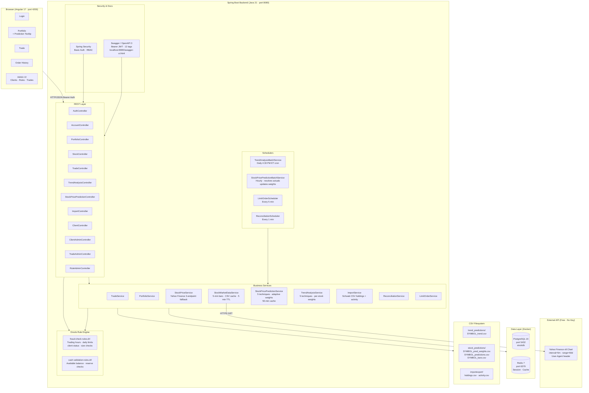

# Stock Brokerage Application

A low-latency stock brokerage web application built with Spring Boot backend and Angular frontend.

## Features

- **Low-Latency Trading**: Optimized for high-speed trade execution with Yahoo Finance API integration
- **REST APIs**: Complete REST APIs with Swagger documentation
- **Rule Engine**: Drools-based rule engine for application-wide, client-specific, and trade-level rules
- **Fraud Detection**: Multi-layered fraud detection system with trading hours and limit checks
- **Portfolio Management**: Real-time portfolio tracking with automatic reconciliation
- **Limit Orders**: Automated limit order execution with 5-minute batch processing
- **Account Reconciliation**: Minute-by-minute reconciliation of portfolio and cash balances
- **Admin UI**: Comprehensive admin interface for managing clients, trades, and rules
- **Audit Logging**: Complete event logging for all system activities
- **High-Speed Database**: PostgreSQL with optimized connection pooling
- **Caching**: Redis-based caching for improved performance

## Technology Stack

### Backend
- Java 23 (compatible with JDK 17+)
- Spring Boot 3.2.1
- Spring Data JPA
- Spring Security
- Spring Scheduling
- PostgreSQL 16
- Redis 7
- Drools Rule Engine
- Swagger/OpenAPI
- Jackson with JSR-310 (Java 8 date/time support)

### Frontend
- Angular 17
- TypeScript
- Standalone Components
- Reactive Forms
- Server-Side Rendering (SSR)

## Architecture



## Prerequisites

- **JDK 17 or higher** (Java 23 recommended)
- **Maven 3.9+**
- **Node.js 18+** and npm
- **Docker Desktop** (for PostgreSQL and Redis)
- **Git** (for version control)

## Complete Setup Instructions for New Machine

### 1. Install Prerequisites

#### Windows
```powershell
# Install Chocolatey (if not already installed)
Set-ExecutionPolicy Bypass -Scope Process -Force; [System.Net.ServicePointManager]::SecurityProtocol = [System.Net.ServicePointManager]::SecurityProtocol -bor 3072; iex ((New-Object System.Net.WebClient).DownloadString('https://community.chocolatey.org/install.ps1'))

# Install tools
choco install openjdk -y
choco install maven -y
choco install nodejs -y
choco install docker-desktop -y
choco install git -y
```

#### macOS
```bash
# Install Homebrew (if not already installed)
/bin/bash -c "$(curl -fsSL https://raw.githubusercontent.com/Homebrew/install/HEAD/install.sh)"

# Install tools
brew install openjdk@23
brew install maven
brew install node
brew install --cask docker
brew install git
```

#### Linux (Ubuntu/Debian)
```bash
sudo apt update
sudo apt install openjdk-23-jdk maven nodejs npm docker.io docker-compose git -y
```

### 2. Extract Project Files

Extract the project zip file to your desired location:
```bash
# Example
unzip ws-trd-1.zip -d ~/projects/
cd ~/projects/ws-trd-1
```

### 3. Start Database Services (Docker)

Start PostgreSQL and Redis using Docker Compose:
```bash
docker-compose up -d
```

Verify services are running:
```bash
docker ps
```

You should see both `stockdb-postgres` and `stockdb-redis` containers running.

### 4. Configure Application (Optional)

The application is pre-configured with default settings. If needed, you can modify:

**Backend Configuration** (`src/main/resources/application.yml`):
- Database connection (default: localhost:5432)
- Redis connection (default: localhost:6379)
- Server port (default: 8080)

**Frontend Configuration** (`frontend/src/app/services/api.service.ts`):
- API base URL (default: http://localhost:8080/api)

### 5. Build and Run Backend

```bash
# Navigate to project root
cd ws-trd-1

# Clean and build (skips tests for faster build)
mvn clean package -DskipTests

# Run the backend
mvn spring-boot:run
```

The backend will start on http://localhost:8080

### 6. Build and Run Frontend

Open a new terminal:

```bash
# Navigate to frontend directory
cd ws-trd-1/frontend

# Install dependencies
npm install

# Start development server
npm run dev
```

The frontend will start on http://localhost:4200

### 7. Access the Application

- **Frontend**: http://localhost:4200
- **Backend API**: http://localhost:8080/api
- **Swagger UI**: http://localhost:8080/swagger-ui.html

### 8. Default User Accounts

#### Admin Users
- Username: `admin1` / Password: `pass1234`
- Username: `admin2` / Password: `pass1234`

#### Client Users
- Username: `client1` / Password: `pass1234` (Alice Johnson - $100,000)
- Username: `client2` / Password: `pass1234` (Bob Smith - $50,000)
- Username: `client3` / Password: `pass1234` (Charlie Brown - $75,000)
- Username: `client4` / Password: `pass1234` (Diana Prince - $150,000)
- Username: `client5` / Password: `pass1234` (Eve Davis - $25,000)

## Key Features Explained

### Trading System
- **Market Orders**: Execute immediately at current market price
- **Limit Orders**: Placed as PENDING, auto-executed when price conditions met
- **Batch Processing**: Limit orders checked every 5 minutes
- **Yahoo Finance Integration**: Real-time stock prices with 3-endpoint fallback system
- **Fraud Detection**: Trading hours validation, daily limits, client status checks

### Portfolio Management
- **Real-time Tracking**: Live portfolio with current prices
- **Automatic Reconciliation**: Account balances reconciled every minute
- **Grouped Holdings**: One line per stock with accurate average prices
- **Cash Management**: 
  - Cash Balance: Total available funds
  - Reserved Balance: Funds allocated to pending limit orders
  - Available Balance: Cash Balance - Reserved Balance

### Scheduled Jobs
- **Limit Order Processor**: Runs every 5 minutes
- **Account Reconciliation**: Runs every 1 minute
- **Data Initialization**: Creates default users on first startup

## Troubleshooting

### Backend won't start
```bash
# Check if port 8080 is available
netstat -ano | findstr :8080  # Windows
lsof -i :8080                  # macOS/Linux

# Check database connection
docker logs stockdb-postgres
docker logs stockdb-redis
```

### Frontend build errors
```bash
# Clear node modules and reinstall
cd frontend
rm -rf node_modules package-lock.json
npm install
```

### Database connection errors
```bash
# Restart Docker containers
docker-compose down
docker-compose up -d

# Wait for health checks
docker ps
```

### Trade execution fails
- Verify Yahoo Finance endpoints are accessible
- Check backend logs for rate limiting (429 errors)
- The system uses 3 fallback endpoints automatically

## API Documentation

### Authentication
```bash
# Login
POST http://localhost:8080/api/auth/login
Content-Type: application/json

{
  "username": "client1",
  "password": "pass1234"
}
```

### Trading
```bash
# Execute Market Order
POST http://localhost:8080/api/trade/execute
Authorization: Basic {credentials}

{
  "clientId": 1,
  "symbol": "TQQQ",
  "quantity": 10,
  "price": 55.43,
  "type": "BUY",
  "orderType": "MARKET"
}

# Execute Limit Order
POST http://localhost:8080/api/trade/execute
Authorization: Basic {credentials}

{
  "clientId": 1,
  "symbol": "TECL",
  "quantity": 5,
  "price": 60.00,
  "type": "BUY",
  "orderType": "LIMIT"
}
```

### Portfolio
```bash
# Get Portfolio Summary
GET http://localhost:8080/api/portfolio/client/{clientId}/summary
Authorization: Basic {credentials}
```

## Project Structure

```
ws-trd-1/
├── src/
│   ├── main/
│   │   ├── java/
│   │   │   └── com/example/stockbrokerage/
│   │   │       ├── config/          # Configuration classes
│   │   │       ├── controller/      # REST controllers
│   │   │       ├── dto/            # Data transfer objects
│   │   │       ├── entity/         # JPA entities
│   │   │       ├── exception/      # Exception handling
│   │   │       ├── repository/     # Data repositories
│   │   │       └── service/        # Business logic
│   │   │           ├── TradeService.java
│   │   │           ├── PortfolioService.java
│   │   │           ├── LimitOrderScheduler.java
│   │   │           ├── ReconciliationService.java
│   │   │           └── StockPriceService.java
│   │   └── resources/
│   │       ├── application.yml     # App configuration
│   │       └── rules/              # Drools rule files
│   └── test/                       # Unit tests
├── frontend/
│   └── src/
│       └── app/
│           ├── components/         # Angular components
│           └── services/           # Angular services
├── docker-compose.yml              # Docker services
├── pom.xml                        # Maven dependencies
└── README.md                      # This file
```

## Creating Portable Package

To move this project to another machine:

### Option 1: Using Git (Recommended)
```bash
# On current machine - commit and push
git add .
git commit -m "Latest changes"
git push origin main

# On new machine - clone
git clone <your-repo-url>
cd ws-trd-1
```

### Option 2: Manual ZIP
1. **Exclude these folders/files** (they will be regenerated):
   - `target/`
   - `frontend/node_modules/`
   - `frontend/dist/`
   - `frontend/.angular/`
   - `.git/` (if not using git)
   - `logs/`

2. **Create ZIP**:
   ```bash
   # Windows PowerShell
   Compress-Archive -Path ws-trd-1 -DestinationPath ws-trd-1-portable.zip

   # macOS/Linux
   zip -r ws-trd-1-portable.zip ws-trd-1 -x "*/target/*" "*/node_modules/*" "*/dist/*" "*/.angular/*" "*/logs/*"
   ```

3. **Transfer** the ZIP file to new machine

4. **Extract and follow** Setup Instructions above

## Important Notes

- **Yahoo Finance API**: Public API with rate limits (~1-2 requests/minute). System uses 3 fallback endpoints.
- **Initial Startup**: Takes ~30 seconds as database schema is created and sample data loaded
- **Reconciliation**: First reconciliation runs 1 minute after startup
- **Limit Orders**: First batch processing runs 5 minutes after startup
- **Data Persistence**: All data stored in Docker volumes, persists across restarts

## Production Deployment

For production deployment:

1. **Update Configuration**:
   - Change default passwords
   - Configure external database
   - Set up proper SSL/TLS
   - Configure CORS for production domain

2. **Build for Production**:
   ```bash
   # Backend
   mvn clean package

   # Frontend
   cd frontend
   npm run build
   ```

3. **Deploy**:
   - Backend JAR: `target/stock-brokerage-1.0-SNAPSHOT.jar`
   - Frontend: `frontend/dist/browser/`

## License

This project is for educational purposes.

## Support

For issues or questions:
1. Check the Troubleshooting section
2. Review backend logs: Check console output
3. Review frontend logs: Browser Developer Console (F12)
4. Check Docker logs: `docker logs stockdb-postgres` or `docker logs stockdb-redis`

Run the application:
```bash
mvn spring-boot:run
```

Or run the JAR directly:
```bash
java -jar target/stock-brokerage-1.0-SNAPSHOT.jar
```

The backend will start on `http://localhost:8080`

### 3. Frontend Setup

```bash
cd frontend
npm install
npm start
```

The frontend will start on `http://localhost:4200`

## API Documentation

Once the backend is running, access Swagger UI at:
- http://localhost:8080/swagger-ui.html
- API Docs: http://localhost:8080/api-docs

## Key Endpoints

### Trading APIs
- `POST /api/trades` - Execute a new trade
- `GET /api/trades` - Get all trades
- `GET /api/trades/{id}` - Get trade by ID
- `GET /api/trades/client/{clientId}` - Get trades by client

### Admin APIs - Clients
- `GET /api/admin/clients` - Get all clients
- `POST /api/admin/clients` - Create new client
- `PUT /api/admin/clients/{id}` - Update client
- `DELETE /api/admin/clients/{id}` - Delete client

### Admin APIs - Rules
- `GET /api/admin/rules` - Get all rules
- `POST /api/admin/rules` - Create new rule
- `PUT /api/admin/rules/{id}` - Update rule
- `DELETE /api/admin/rules/{id}` - Delete rule

## Rule Engine

The application uses Drools rule engine for:
- Application-wide rules (apply to all trades)
- Client-specific rules (apply to specific clients)
- Trade-level rules (apply to individual trades)

Rule types include:
- `FRAUD_CHECK` - Fraud detection rules
- `RISK_LIMIT` - Risk management rules
- `TRADING_HOURS` - Trading time restrictions
- `POSITION_LIMIT` - Position size limits
- `PRICE_VALIDATION` - Price validation rules

## Fraud Detection

The system includes multiple fraud detection layers:
- Client status verification
- Trading hours validation
- Daily trade limit checks
- Unusual trade size detection
- Account balance verification

## Performance Optimizations

- Connection pooling (HikariCP)
- Redis caching for frequently accessed data
- Async audit logging
- Optimized database queries with indexes
- Batch processing for database operations

## Admin UI Features

1. **Client Management**
   - View all clients
   - Create/update/delete clients
   - Filter by status and risk level
   - View audit logs per client

2. **Rule Management**
   - View all rules
   - Create/update/delete rules
   - Filter by type and level
   - Activate/deactivate rules

3. **Trade Monitoring**
   - View all trades
   - Filter by status, client, symbol
   - View audit logs per trade

## Security

- Spring Security configured
- CORS enabled for Angular frontend
- Role-based access control (ADMIN role required for admin endpoints)

## Logging

All events are logged to:
- Console (for development)
- File: `logs/stock-brokerage.log`
- Database (audit_logs table)

## Future Enhancements

- WebSocket support for real-time updates
- Advanced analytics and reporting
- Integration with market data providers
- Mobile application
- Microservices architecture
